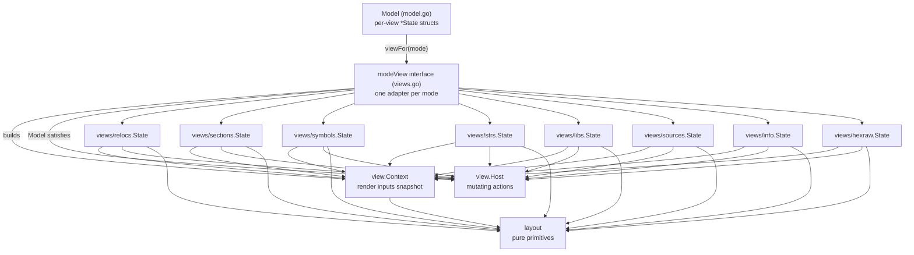

# Architecture

exex is a terminal UI for exploring ELF, Mach-O and PE binaries. This document
describes how the packages relate, the layering rules that keep the codebase
navigable, and the contract that lets individual TUI views live in their own
packages.

## Big picture

```mermaid
graph TD
    main["main.go<br/>(CLI: flags, -o dispatch)"]

    subgraph presentation ["Presentation"]
        ui["internal/ui<br/>Bubble Tea shell: Model, dispatch,<br/>chrome, keymap, mouse, search"]
        dump["internal/dump<br/>plain-text views for -o / pipes"]
        views_relocs["internal/ui/views/relocs"]
        views_sections["internal/ui/views/sections"]
        views_symbols["internal/ui/views/symbols"]
        views_strs["internal/ui/views/strs"]
        views_libs["internal/ui/views/libs"]
        views_more["…/sources · hexraw · info"]
        views_sources["internal/ui/views/sources"]
        views_info["internal/ui/views/info"]
        views_hexraw["internal/ui/views/hexraw"]
        viewpkg["internal/ui/view<br/>Context + Host contract"]
        layout["internal/ui/layout<br/>text/scroll/list/table primitives"]
    end

    subgraph services ["Domain services"]
        explorer["internal/explorer<br/>navigation + disasm service"]
        bytesearch["internal/bytesearch"]
        sourcefiles["internal/sourcefiles"]
        syntax["internal/syntax<br/>source highlighting"]
        cpufeat["internal/cpufeat"]
        syscalls["internal/syscalls"]
    end

    subgraph corelayer ["Core"]
        binfile["internal/binfile<br/>ELF / Mach-O / PE / archives / DWARF"]
        disasm["internal/disasm<br/>uniform decoder over x/arch"]
        arch["internal/arch"]
    end

    subgraph support ["Support"]
        config["internal/config"]
        theme["internal/theme"]
        chroma["internal/chromasubset<br/>+ chromalexers + chromastyles<br/>(curated, embedded XML)"]
    end

    main --> ui
    main --> dump
    ui --> views_relocs
    ui --> views_sections
    ui --> views_symbols
    ui --> views_strs
    ui --> views_libs
    ui --> views_sources
    ui --> views_info
    ui --> views_hexraw
    views_relocs --> viewpkg
    views_sections --> viewpkg
    views_symbols --> viewpkg
    views_strs --> viewpkg
    views_libs --> viewpkg
    views_sources --> viewpkg
    views_info --> viewpkg
    views_hexraw --> viewpkg
    viewpkg --> layout
    ui --> layout
    ui --> explorer
    ui --> syntax
    dump --> binfile
    explorer --> binfile
    explorer --> disasm
    syntax --> chroma
    theme --> chroma
    ui --> config
    ui --> theme
    binfile --> arch
    disasm --> arch
    ui -.-> bytesearch
    ui -.-> sourcefiles
    ui -.-> cpufeat
    ui -.-> syscalls
```

Arrows point from the depender to the dependency. The intended flow is strictly
downward: presentation → services → core, with support packages usable from any
layer. Nothing below `internal/ui` imports it.

## Layers

### Core

- **`internal/binfile`** is the heart: it opens a binary (ELF, Mach-O including
  universal/fat slices and `.dSYM`, PE, `ar` archives) and exposes one neutral
  `File` with sections, segments, symbols, relocations, imports, strings and
  DWARF line/name lookups. Format differences are absorbed here; everything
  above is format-agnostic.
- **`internal/disasm`** wraps `golang.org/x/arch` into a uniform decoder
  (x86-64, ARM64, …) with an instruction classifier (`InstClass`) the UI uses
  for colouring.
- **`internal/arch`** holds the shared CPU-architecture identifiers so binfile
  and disasm agree without importing each other.

### Domain services

Format-neutral logic shared by both frontends: `explorer` (navigation targets,
the windowed disassembly service), `bytesearch` (query → byte patterns),
`sourcefiles` (ranking files referenced by DWARF), `syntax` (source
highlighting), `cpufeat` and `syscalls` (instruction/syscall classification
tables).

### Presentation

Two frontends share the same core:

- **`internal/dump`** renders every view as plain text for `-o` / pipes.
- **`internal/ui`** is the interactive Bubble Tea TUI.

### Support

`config` (YAML user config), `theme` (palettes extracted from Chroma styles),
and the curated Chroma subset: `chromasubset` owns the embedded XML lexer/style
assets, `chromalexers`/`chromastyles` expose lazily-built registries. Curating
the subset (instead of importing all of Chroma) keeps the stripped binary about
2 MB smaller; a registry test (`TestUsingGraphIsClosed`) guarantees every
`<using lexer="…"/>` reference stays resolvable within the subset.

## Inside internal/ui

The TUI follows the Elm architecture (Bubble Tea): one `Model`, `Update`,
`View`. The package is large, so it is being decomposed along three seams:

### 1. `internal/ui/layout` — pure primitives

Model-independent building blocks: ANSI-aware padding/truncation/wrapping,
scroll anchoring (`VisualTop`, `ViewportTop`, `PageStep`), list navigation
(`NavKey`), filtering (`ContainsFold`), facet cycling, generic sortable-header
hit-testing (`SortableHeaderCol[T]`, `SortHeaderLabel`), overlays, a bounded
per-row render memo (`RowMemo[K,V]`), and the collapsible name tree shared by
the symbols/sources/libs views (`TreeNode`/`TreeRow`, `BuildScopedTree`,
`FlattenTree`, fold helpers). No imports from the rest of the UI, so it is
trivially testable and reusable.

### 2. `internal/ui/view` — the view contract

The neutral seam between the shell and the individual views, so a view package
never imports `ui` (which would be an import cycle):

- **`view.Context`** is a per-frame snapshot of render inputs: the `*binfile.File`,
  geometry (`Width`, `BodyH`) and global toggles (`Wrap`, `Detached`,
  `TreeCollapseDefault`), plus shared presentation helpers (`TableHeader`,
  `EmptyBody`, `EmptyList`, `VisualTop`, `TreeNodeRow`). Context is passed by
  value through view helpers — often per visible row — so it must stay a few
  machine words; `TestContextStaysSmall` enforces a 64-byte budget. The style
  vocabulary hangs off the embedded **`*view.Styles`**: ~20 exported
  `lipgloss.Style` fields (the shell's full `Theme` stays private), the
  theme-derived classifier closures (`SectionStyle`, `SegmentStyle`,
  `SymbolStyle`, `PathStyle`, `SymbolDisplay`, …), and settings-modal-owned
  display knobs (`HexBytesPerRow`, `HideAnnotations`). The shell builds one
  Styles lazily and caches it until a theme/settings change
  (`m.viewStylesCache`); the closures read `m` at call time so they never go
  stale. (Closures, not method values — a method value on the large `Theme`
  struct would copy it to the heap per call. And styles on Styles, not
  Context: inlining them made Context ~13 KB and hex full-frame renders ~60%
  slower from per-row copies.)
- **`view.Host`** is the small interface of mutating actions a view may trigger
  on the shell: `SetStatus`, cross-view jumps (`JumpHexAtAddr`,
  `JumpDisasmAtAddr`, `JumpRawAtAddr`, `OpenHexAt`, `OpenRawAt`,
  `OpenSymbol`, `OpenSymbolsForLib`, `OpenSourceFile`), cache invalidation
  signals (`SymbolNamesChanged`), `CopyToClipboard`, `ToggleWrap`, and paging
  (`ListPage`/`SetPageRows`).
  `*Model` satisfies it via thin exported wrappers in `viewcontext.go`.
- **`view.RowCacheKey`** is the shared memo key (item index + every layout input
  that changes how a row renders).

### 3. `internal/ui/views/*` — self-contained views

Views converted to the contract live in their own packages, holding their own
`State` (cursor, filter, sort, facets, row caches) with methods shaped
`func (st *State) X(ctx view.Context, host view.Host, …)`:

- **`views/relocs`** — the pilot: the relocation table (filter, facets, sort,
  header clicks, rendering) with zero knowledge of the shell.
- **`views/sections`** — sections/segments tables, including the `t` mode
  toggle, type/flags facets and the sortable header.
- **`views/symbols`** — the largest view: flat table + collapsible namespace
  tree, kind/scope/bind facets, clickable facet chips, per-row/global
  argument abbreviation (`AbbrevBrackets` is exported — the shell's
  `displaySymbolName` applies it to disasm/hex annotations too), and the
  demangle interplay (`OnNamesChanged` invalidates name-derived state).
- **`views/strs`** — the Strings view: filterable table + the compact
  "·"-separated flow layout with its 2-D packing/navigation geometry, the
  section/paths-only facets, and the path/URL heuristic. (Named `strs`, not
  `strings`, to avoid colliding with the standard library.)
- **`views/libs`** — the Libraries view: DT_NEEDED entries as a flat list or
  path tree with the linkage-context header (interpreter, libc, RPATH), name
  filter and the on-disk/in-cache availability lens (it classifies via
  `explorer.ResolveLibPath` and caches per path). Opening a library as the
  primary file replaces the whole `Model`, which is beyond the `view.Host`
  surface — the shell's key adapter intercepts that one key ("o").
- **`views/sources`** — the Sources file list (DWARF): project-first flat list
  or directory tree with the present/missing availability lens. Opening a file
  switches to the disasm split pane, which stays in the shell
  (`view_sources.go`) because it drives the disasm window and cursor.
- **`views/hexraw`** — one package for both byte views (Hex is
  virtual-address-based, Raw file-offset-based) sharing a `ByteSource`
  abstraction: rendering, cursor/scroll geometry, section pins/seeking, the
  data inspector, word interpretations and pointer following. Its render path
  takes `*view.Context` (per-byte hot path).
- **`views/info`** — the Info overview page (header table, overview,
  hardening, linking and toolchain blocks) with its styled-body cache.
  Archive-member browsing and fat-arch switching stay in the shell — both
  replace the whole `Model`.
- **`views/sources`** — the Sources file list: DWARF-referenced source files as
  a project-first flat list or path tree, with name filtering and an on-disk
  availability lens. Opening a file switches to the shell-owned disasm
  source-first split pane via `view.Host`.
- **`views/info`** — the normal Info overview page: a cached, scrollable header /
  overview / hardening / linking summary. Archive member browsing and fat-arch
  switching stay in the shell because they replace the whole `Model`.
- **`views/hexraw`** — the shared Hex/Raw byte-dump views: virtual-address image
  rendering, raw-file rendering, byte cursors/tops, section pinning, pointer
  decoding/following, byte-row geometry and mouse hit-testing. Shell glue for
  cross-view address/offset opens stays in `byteopen.go`.

The shell keeps one field per converted view on `Model` (`m.relocs`,
`m.sections`, `m.symbols`, `m.strs`, `m.libs`, `m.sources`, `m.info`,
`m.byteViews`) and the thin `modeView` adapter in `views.go` forwards
`body`/`handleKey`/`sortHeaderClick`/`captureFilter` into the package with
`(m.viewContext(), m)`. Cross-view routing that needs shell internals stays in
the shell: `openSymbol`/`canDisasmAt`/`displaySymbolName` live in
`symbolopen.go`, the `-s` flag's `openStringSearch` (which switches modes) in
`stringsearch.go`, byte-view address/offset opens in `byteopen.go`, and the Libs
view's model-swapping `openLibAsPrimary` + mode-switching `openSymbolsForLib` in
`libopen.go`; views reach such actions via `view.Host`.

Views not yet converted (disasm) still live as `Model` methods in `view_*.go`
files with their state embedded in `Model`; the `modeView` interface already
centralises dispatch, so it can be migrated along the same recipe:

1. Change the view's methods to hang off its `*State` and take
   `(ctx view.Context, host view.Host)`; add any missing action to `view.Host`
   or style to `view.Context`.
2. Move the state struct + methods into `internal/ui/views/<name>`, exporting
   the fields the shell/tests touch.
3. Replace the embedded state with a named `Model` field and rewire the
   adapter, `new.go` construction, mouse geometry and the central filter
   capture.

### Shell responsibilities that stay in `ui`

Cross-view concerns remain in the shell: mode switching and history (`nav.go`,
`jump.go`), the frame chrome (header/tabs/footer/status in `chrome.go`,
`render.go`), key normalisation and dispatch (`keymap.go`, `key_dispatch.go`),
mouse routing and wheel momentum (`mouse.go`), the goto/search/settings/xref
overlays, background work (async disasm decode, demangling), clipboard, and
cross-file navigation (`crossfile.go`, `archive.go`).

## Rendering & performance conventions

- **Row memoisation**: table views render a row once per
  `(index, width, addrW, wrap)` via `layout.RowMemo` and reuse it until a cache
  is invalidated (filter/sort/theme changes). Height caches serve the scroll
  math without re-rendering.
- **Frame cache**: `Model.View()` re-renders only when `viewDirty`; wheel input
  is coalesced and applied on a tick.
- **Windowed disassembly**: disasm decodes a bounded window around the target
  address (first window in the background), never the whole image.
- **Lazy everything**: strings/sources/symbols views build their lists on first
  entry; Chroma lexers/styles are parsed from embedded XML on first use
  (`sync.OnceValue`).
- **`tools/perfreport`** measures parse, per-view render time/allocations,
  peak live heap and peak RSS against a sample binary (CI feeds it the freshly
  built exex). **Peak heap in use** (a 1 ms `runtime/metrics` sampler) is the
  number to compare across branches; **peak resident memory** also counts
  arena over-reservation and not-yet-returned pages, which on macOS swings
  ±40 MB between runs with byte-identical heap behaviour.
  `internal/ui/render_bench_test.go` has `-benchmem` benchmarks
  (`EXEX_BENCH_BIN=<bin> go test ./internal/ui -bench View -benchmem`) for
  steady-state per-frame allocation checks. One-shot alloc numbers in
  perfreport's TUI rows are noisy (GC timing); trust the benchmarks for
  regression calls.

## Build variants

- Default build embeds the curated Chroma subset for syntax highlighting.
- `-tags lite` drops Chroma entirely (`disasm_syntax_lite.go`) for a smaller
  binary; the UI falls back to theme-only colouring.
